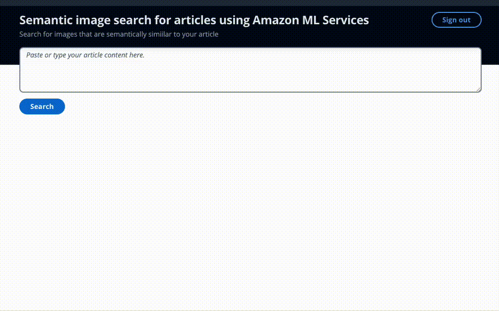

# Semantic image search using Amazon Titan Multimodal Embeddings model

Digital publishers are continuously looking for ways to streamline and automate their media workflows to generate and publish new content as rapidly as they can, but without foregoing quality.

Adding images to capture the essence of text can improve the reading experience. Machine learning techniques can help you discover such images. [“A striking image is one of the most effective ways to capture audiences' attention and create engagement with your story - but it also has to make sense”](https://www.journalism.co.uk/news/five-rules-to-make-your-article-images-more-engaging/s2/a789231/). 

In this aws-samples project, you see how you can use Amazon Titan foundation models to quickly understand an article and find the best images to accompany it. This time, you generate the embedding directly from the image.

A key concept in semantic search is embeddings. An embedding is a numerical representation of some input—an image, text, or both—in the form of a vector. When you have many vectors, you can measure the distance between them, and vectors that are close in distance are semantically similar or related.

[Amazon Bedrock](https://aws.amazon.com/bedrock/) is a fully managed service that offers a choice of high-performing foundation models (FMs) from leading AI companies including AI21 Labs, Anthropic, Cohere, Meta, Stability AI, and Amazon with a single API, along with a broad set of capabilities to help you build generative AI applications, simplifying development while maintaining privacy and security.

[Amazon Titan](https://aws.amazon.com/bedrock/titan/) has recently added a new embedding model to its collection, Titan Multimodal Embeddings. This new model can be used for multimodal search, recommendation systems, and other downstream applications.

Multimodal models can understand and analyze data in multiple modalities such as text, image, video, and audio. This latest Amazon Titan model can accept text, images, or both. This means you use the same model to generate embeddings of images and text and use those embeddings to calculate how similar the two are.



## Deploying the full stack application


These following steps talk through the sequence of actions that enable semantic image and celebrity search.
1.	You upload an image to an Amazon S3 bucket
2.	Amazon EventBridge listens to this event, and then triggers an AWS Step function execution
3.	The Step Function takes the Amazon S3 image details and runs 3 parallel actions
1.	API call to Amazon Rekognition DetectLabels to extract object metadata
2.	API call to Amazon Rekognition RecognizeCelebrities APIs to extract any known celebrities
3.	AWS Lambda resizes the image to accepted max dimensions for the ML embedding model and generates an embedding direct from the image input
4.	The Lambda function then inserts the image object metadata and celebrity name(s) if present, and the embedding as a k-NN vector into an OpenSearch Service index
5.	Amazon S3 hosts a simple static website, distributed by an Amazon CloudFront. The front-end user interface (UI) allows you to authenticate with the application using Amazon Cognito to search for images
6.	You submit an article or some text via the UI
7.	Another Lambda function calls Amazon Comprehend to detect any names in the text as potential celebrities
8.	The function then summarizes the text to get the pertinent points from the article Using Titan Text G1 - Express
9.	The function generates an embedding of the summarized article using the Titan multimodal model.
10.	The function then searches OpenSearch Service image index for images matching the celebrity name and the k-nearest neighbors for the vector using cosine similarity, using Exact k-NN with scoring script. 
11.	Amazon CloudWatch and AWS X-Ray give you observability into the end-to-end workflow to alert you of any issues.

### Conclusion
In this example, you saw how to use Amazon Rekognition, Amazon Comprehend, Amazon Bedrock, and OpenSearch Service to extract metadata from your images and then use ML techniques to discover them automatically using celebrity and semantic search. This is particularly important within the publishing industry, where speed matters in getting fresh content out quickly and to multiple platforms.

As a next step, deploy the solution in your AWS account and upload some of your own images for testing how semantic search can work for you. 

### Deploy steps

### Pre-requisites

- SAM cli

    The solution uses the [SAM CLI](https://docs.aws.amazon.com/serverless-application-model/latest/developerguide/install-sam-cli.html) for deployment.
    **Make sure to be using latest version of SAM cli**

- Docker

    The solution uses the SAM CLI option to build inside a container to avoid the need for local dependencies. You will need docker available for this.

- Node

    The front end for this solution is a React web application that can be run locally using Node

- npm

    The installation of the packages required to run the web application locally, or build it for remote deployment, require npm.  

### Amazon Bedrock requirements
**Base Models Access**

If you are looking to interact with models from Amazon Bedrock, you need to [request access to the base models in one of the regions where Amazon Bedrock is available](https://console.aws.amazon.com/bedrock/home?#/modelaccess). Make sure to read and accept models' end-user license agreements or EULA.

| Model | Max Token Input | Embedding Dimension | Price for 1K input token | Price for 1K out token | 
| ------------ | ------- | ----- | ---- | ----- |
| Amazon Multimodal Embeddings | 100 | 1024 | $TBC | n/a |

When we summarize the text in our workflow, we can specify the max output tokens on the [Titan Text – Express model](https://aws.amazon.com/bedrock/titan/), and this ensures that we pass in less than 100 tokens to the embedding model. 

The multimodal embedding model also has a max image dimension size of 2048x2048 which we handle as part of the image embedding lambda function. 

Note:
- You can deploy the solution to a different region from where you requested Base Model access.
- **While the Base Model access approval is instant, it might take several minutes to get access and see the list of models in the UI.**      
    
### Deployment

**This deployment is currently set up to deploy into the us-east-1 region. Please check Amazon Bedrock region availability and update the [samconfig.toml](../../blob/dev/samconfig.toml#L19) file to reflect your desired region.**

### Environment setup

#### Deploy with AWS Cloud9
We recommend deploying with [AWS Cloud9](https://aws.amazon.com/cloud9/). 
If you'd like to use Cloud9 to deploy the solution, you will need the following before proceeding:
- select at least `m5.large` as Instance type.
- use `Amazon Linux 2` as the platform.

You can run these commands from your command line/terminal, or you could use AWS Cloud9. 

1. Clone the repository

```bash
git clone https://github.com/aws-samples/semantic-image-search-for-articles.git
```

2. Move into the cloned repository
```bash
cd aws-semantic-image-search
```

#### (Optional) Only for Cloud9
If you use Cloud9, increase the instance's EBS volume to at least 50GB. 
To do this, run the following command from the Cloud9 terminal:
```
bash ./scripts/cloud9-resize.sh
```
See the documentation for more details [on environment resize](https://docs.aws.amazon.com/cloud9/latest/user-guide/move-environment.html#move-environment-resize). 


Review this file: [samconfig.toml](../../blob/dev/samconfig.toml#L19)

Here you can name your stack, and pick the region you want to deploy in. 
* `region = "us-east-1"`

Check if the AWS services are all available in the region you are choosing. 

As the deployment will deploy Amazon CloudFront, this can take approximately 20 minutes. 

Cloud9 generates STS token's to do the deployment, however, these credentials only last 15 minutes, therefore the token will expire before the deployment is complete, and therefore you won't be able to see the outputs directly from Cloud9. 

[How to Authenticate with short-term credentials](https://docs.aws.amazon.com/cli/latest/userguide/cli-authentication-short-term.html)
You can export the access key tokens, making sure they last at least 30 minutes or 1800 seconds:
```bash
export AWS_ACCESS_KEY_ID= <PASTE_ACCESS_KEY>
export AWS_SECRET_ACCESS_KEY= <PASTE_SECRET_ACCESS_KEY>
export AWS_SESSION_TOKEN= <PASTE_SESSION_TOKEN>
```

(If the tokens do expire, you can leave the deployment to complete, checking progress within CloudFormation, and then re-run the deployment script below - as the Amazon CloudFront resource will already exist, the deployment will complete quickly)

### Run the deployment of the application

The deployment of the solution is achieved with the following command:

```bash
npm install && npm run deploy
```

This command will run a series of scripts such as `sam build`, `sam deploy` and a few others to set up the front end environment with the correct variables.


### Create login details for the web application
The authenication is managed by Amazon Cognito. You will need to create a new user to be able to login. 

You can find the userpool id from the cloudformation output and choose that userpool and create a new user there to login with.


### Login to your new web application

Once complete, the CLI output will show a value for the CloudFront url to be able to view the web application, e.g. https://d123abc.cloudfront.net/ - you can also see this in the CloudFormation outputs.

## Administration

The Web App allows the user to upload images to S3 and be indexed by OpenSearch as well as issuing queries to OpenSearch to return the top 10 images that are most semantically related to the article content.

### Cleaning up
To avoid incurring future charges, delete the resources.
1.	Find the S3 bucket deployed with this solution and empty the bucket
2.	Run ```sam delete``` from the terminal, or Go to CloudFormation, choose the stack that you deployed via the deploy script mentioned above, and delete the stack. 


## Security

See [CONTRIBUTING](CONTRIBUTING.md#security-issue-notifications) for more information.

## License

This library is licensed under the MIT-0 License. See the LICENSE file.

